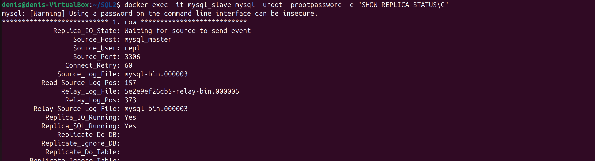
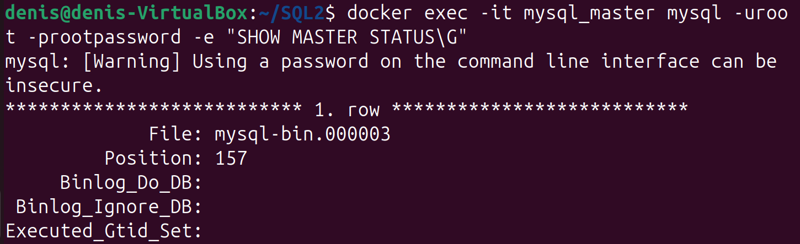
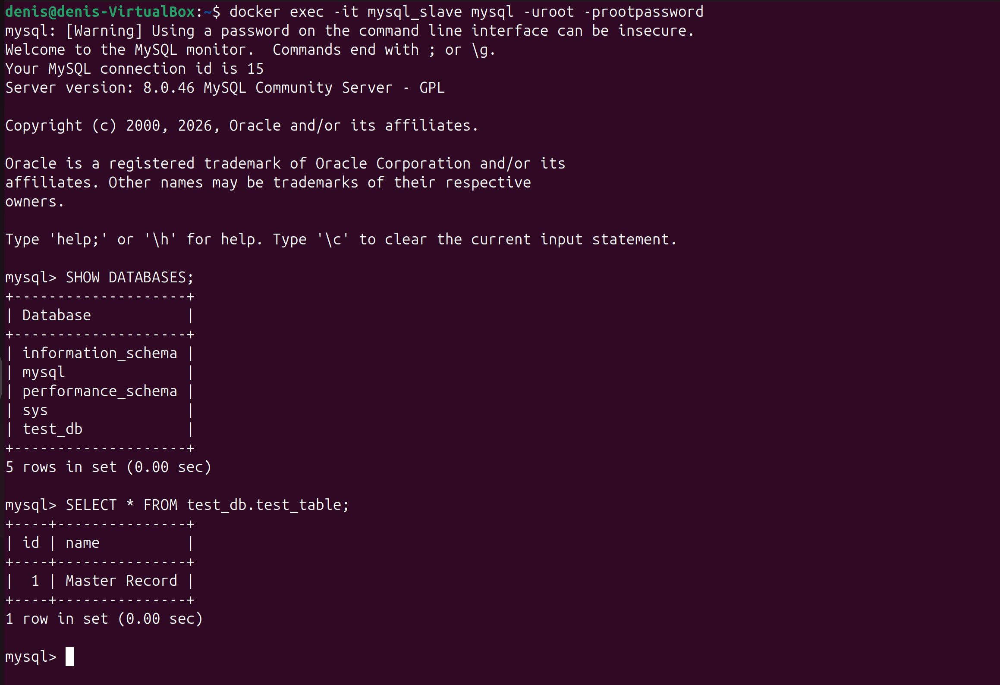

# Домашнее задание к занятию «Репликация и масштабирование. Часть 1 - Мурашов Денис»

## Задание 1

**master-slave** - один главный сервер (master) на запись, один или несколько подчиненных (slave) на чтение. Все изменения делаются на мастере, слейвы копируют их к себе через бинлог и работают только на чтение. Удобно, когда чтения много, а записи мало, и для отказоустойчивости. Минус - писать можно только в мастер, если он падает, запись встает, пока слейв вручную не сделают мастером.

**master-master** - Каждый сервер одновременно и master, и slave. Писать и читать можно с любого, изменения в обе стороны. Плюс - выше доступность, упал один, второй продолжает принимать запись. Минус - если писать в оба сразу, могут произойти конфликты.

## Задание 2

Настроена master-slave репликация MySQL в Docker.

### Файлы конфигурации

`Dockerfile_master`
```dockerfile
FROM mysql:8.0
COPY ./master.cnf /etc/mysql/conf.d/my.cnf
COPY ./master.sql /docker-entrypoint-initdb.d/start.sql
ENV MYSQL_ROOT_PASSWORD=rootpassword
CMD ["mysqld"]
```

`master.cnf`
```ini
[mysqld]
server-id = 1
log-bin = mysql-bin
binlog-format = ROW
```

`master.sql`
```sql
CREATE USER 'repl'@'%' IDENTIFIED BY 'slavepass';
GRANT REPLICATION SLAVE ON *.* TO 'repl'@'%';
FLUSH PRIVILEGES;
```

`Dockerfile_slave`
```dockerfile
FROM mysql:8.0
COPY ./slave.cnf /etc/mysql/conf.d/my.cnf
COPY ./slave.sql /docker-entrypoint-initdb.d/start.sql
ENV MYSQL_ROOT_PASSWORD=rootpassword
CMD ["mysqld"]
```

`slave.cnf`
```ini
[mysqld]
server-id = 2
read-only = 1
```

`slave.sql`
```sql
CHANGE REPLICATION SOURCE TO
  SOURCE_HOST='mysql_master',
  SOURCE_USER='repl',
  SOURCE_PASSWORD='slavepass',
  SOURCE_SSL=1;
START REPLICA;
```

### Сборка и запуск

```bash
docker build -t mysql_master -f ./Dockerfile_master .
docker build -t mysql_slave -f ./Dockerfile_slave .
docker network create replication
docker run -d --name mysql_master --net replication -p 3306:3306 mysql_master
docker run -d --name mysql_slave --net replication -p 3307:3306 mysql_slave
```

### Проверка

Статус слейва:



Статус мастера:



Тест репликации. На мастере создана база и запись:

```sql
CREATE DATABASE test_db;
USE test_db;
CREATE TABLE test_table (id INT PRIMARY KEY, name VARCHAR(50));
INSERT INTO test_table VALUES (1, 'Master Record');
```

На слейве база test_db и запись Master Record появились автоматически:


